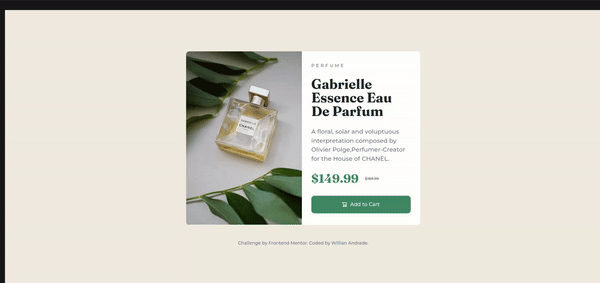

# Frontend Mentor - Product preview card component solution

This is my solution to the [Product preview card component challenge on Frontend Mentor](https://www.frontendmentor.io/challenges/product-preview-card-component-GO7UmttRfa). Frontend Mentor challenges help you improve your coding skills by building realistic projects. 

## Table of contents

- [Overview](#overview)
  - [The challenge](#the-challenge)
  - [Demos](#screenshot)
  - [Links](#links)
- [My process](#my-process)
  - [Built with](#built-with)
  - [What I learned](#what-i-learned)
  - [Useful resources](#useful-resources)
- [Author](#author)

## Overview

### The challenge

Users should be able to:

- View the optimal layout depending on their device's screen size
- See hover and focus states for interactive elements

### Screenshot
#### Desktop


#### Mobile


#### Demo


### Links

- Solution: [Solution](https://github.com/Will-Andrade/product-preview-card)
- Live Site: [Live](https://ad-product-preview-card.netlify.app/)

## My process

### Built with

- Semantic HTML5 markup
- CSS custom properties
- Flexbox
- CSS Grid

### What I learned

When using the HTML `<picture></picture>` and `<source />` tags we are able to render different images into the page depending on the values we pass to a attribute named `media`, which is basically a media query. 

To see how this works, here is a demo:

```html
<picture>
  <source media="(min-width:1000px)" srcset="image.jpg" alt="your image" />
  
</picture>
```

By doing just that we ensure that, without any more css, whenever the screen reaches `1000px` of width, the image in the `<source />` will be rendered. Otherwise, we will render the default ``. Amazing!

### Useful resources

- [Picture MDN page](https://developer.mozilla.org/en-US/docs/Web/HTML/Element/picture) - Helped me understand the picture tag and it's implementation details.
- [Source MDN page](https://developer.mozilla.org/en-US/docs/Web/HTML/Element/source) - Helped me understand the source tag and it's media attribute.

## Author

- GitHub - [Will-Andrad](https://github.com/Will-Andrade)
- Frontend Mentor - [@Will-Andrade](https://www.frontendmentor.io/profile/Will-Andrade)
